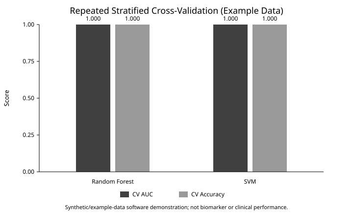

# Metagenomic Biomarker Discovery Pipeline for Colorectal Cancer

## Overview

This portfolio project documents a colorectal-cancer metagenomics workflow spanning raw sequencing QC, adapter trimming, taxonomic classification, microbial feature generation, statistical testing, and machine-learning analysis.

The **public repository is a reproducible demonstration of selected downstream workflow components** using an example microbial abundance table. Raw FASTQ data and the original preprocessing environment are not distributed here, so the public code should not be interpreted as a full reproduction of the broader project.

## Public Repository Scope

The public demo includes:

- microbial abundance-table loading with numeric, missing-value, finite-value, and label validation;
- per-feature Kruskal-Wallis testing;
- Benjamini-Hochberg false-discovery-rate correction;
- stratified hold-out evaluation plus repeated stratified cross-validation;
- Random Forest and SVM classification;
- ROC-AUC, accuracy, classification-report, and CV summary export to JSON;
- Random Forest feature-importance export;
- visualizations generated from real pipeline outputs;
- pytest-based automated tests;
- GitHub Actions continuous integration;
- a generic SLURM submission example; and
- a compact Snakemake workflow.

The broader project context included FastQC, Cutadapt, Kraken2, larger FASTQ processing, Linux/HPC execution, additional statistical analyses, and workflow optimization. Those broader components are documented as project experience but are not all reproduced by the current public scripts.

## Public Data Scope

The executable demo starts from:

```text
data/example_abundance_table.csv
```

The included table is a small software-demonstration dataset, not patient-level evidence or a validation cohort. The label column is binary (`0`/`1`). See `data_description.md` for the distinction between the public demo and broader project context.

## Reproducible Example Results

The committed example snapshot uses 3-fold repeated stratified cross-validation with 2 repeats (6 validation folds total).

| Model | CV ROC-AUC, mean ± SD | CV accuracy, mean ± SD |
|---|---:|---:|
| Random Forest | 1.000 ± 0.000 | 1.000 ± 0.000 |
| SVM | 1.000 ± 0.000 | 1.000 ± 0.000 |



These near-perfect values reflect the intentionally small, strongly separated example dataset. They are **pipeline-demonstration results, not colorectal-cancer biomarker performance**.

Committed machine-readable outputs:

- [`results/example_model_metrics.json`](results/example_model_metrics.json)
- [`results/example_kruskal_wallis_results.csv`](results/example_kruskal_wallis_results.csv)
- [`results/example_random_forest_feature_importance.csv`](results/example_random_forest_feature_importance.csv)

The example statistical output contains raw p-values, Benjamini-Hochberg FDR-adjusted q-values, and an `FDR < 0.05` indicator. With this synthetic/example dataset, all six demonstration features pass the chosen threshold; that should not be interpreted as evidence of real colorectal-cancer associations.

## Technologies

### Bioinformatics context

- FastQC
- Cutadapt
- Kraken2
- FASTQ processing
- taxonomic classification
- microbial abundance profiling

### Programming and workflow

- Python
- pandas / NumPy
- SciPy
- statsmodels
- scikit-learn
- matplotlib
- pytest
- GitHub Actions
- Snakemake
- Linux/HPC
- SLURM
- Git/GitHub

### Machine learning and statistics

- Random Forest
- Support Vector Machine
- Kruskal-Wallis testing
- Benjamini-Hochberg FDR correction
- repeated stratified cross-validation
- ROC-AUC and accuracy evaluation
- feature-importance analysis

## Repository Structure

```text
colorectal-cancer-metagenomics-pipeline/
├── .github/workflows/ci.yml
├── README.md
├── data_description.md
├── requirements.txt
├── data/
│   └── example_abundance_table.csv
├── src/
│   ├── metagenomics_ml_pipeline.py
│   └── visualize_microbiome_results.py
├── tests/
│   └── test_metagenomics_pipeline.py
├── hpc/
│   └── run_metagenomics_demo.slurm
├── workflow/
│   ├── Snakefile
│   └── config.yaml
├── figures/
│   └── model_cv_performance.svg
├── results/
│   ├── example_model_metrics.json
│   ├── example_kruskal_wallis_results.csv
│   ├── example_random_forest_feature_importance.csv
│   └── results_summary.md
├── reports/
├── notebooks/
└── LICENSE
```

## How to Run the Public Demo

### 1. Clone and install

```bash
git clone https://github.com/Hemalatha18-bio/colorectal-cancer-metagenomics-pipeline.git
cd colorectal-cancer-metagenomics-pipeline
python -m venv .venv
source .venv/bin/activate
pip install -r requirements.txt
```

On Windows, use `.venv\Scripts\activate`.

### 2. Run statistics and model evaluation

```bash
python src/metagenomics_ml_pipeline.py \
  --input data/example_abundance_table.csv \
  --cv-splits 3 \
  --cv-repeats 2 \
  --metrics-output results/model_metrics.json \
  --stats-output results/kruskal_wallis_results.csv \
  --importance-output results/random_forest_feature_importance.csv
```

The code validates the feature matrix before analysis. Model preprocessing is fitted inside scikit-learn pipelines, including within cross-validation folds, to avoid learning preprocessing parameters from validation data.

The exported JSON contains an illustrative hold-out estimate plus repeated-CV mean/standard-deviation summaries. For this tiny demo, neither should be interpreted as a scientific benchmark.

### 3. Generate plots

```bash
python src/visualize_microbiome_results.py \
  --input data/example_abundance_table.csv \
  --metrics results/model_metrics.json \
  --importance results/random_forest_feature_importance.csv \
  --output-dir figures
```

The visualization step reads pipeline-generated metrics and feature importance rather than hard-coded values.

### 4. Run tests

```bash
pytest -q
```

Tests cover input validation, FDR output, invalid CV settings, model metrics, and repeated-CV summaries. GitHub Actions runs the suite automatically on pushes and pull requests targeting `main`.

### 5. Run with Snakemake

```bash
snakemake --snakefile workflow/Snakefile --cores 1
```

The Snakemake workflow connects the example abundance table to statistical/model analysis and visualization.

### 6. HPC / SLURM example

`hpc/run_metagenomics_demo.slurm` shows how the public-demo workflow can be submitted to a SLURM-based environment. Cluster-specific account, partition, module, environment, and resource settings must be adapted locally.

## Broader Project Context

The broader methodology included:

1. organization of stool FASTQ data and metadata;
2. FastQC quality assessment;
3. adapter and quality trimming with Cutadapt;
4. taxonomic classification with Kraken2;
5. microbial abundance-table generation;
6. filtering and normalization;
7. biomarker-oriented statistical testing;
8. Random Forest/SVM modeling;
9. model evaluation and feature interpretation; and
10. Linux/HPC execution and workflow optimization.

Those activities represent broader project experience. Quantitative claims from that broader work are intentionally not presented as public-demo results unless the supporting data and reproducible analysis are available in this repository.

## Limitations

- The public repository starts from an example abundance table rather than raw FASTQ files.
- It does not reproduce the complete FastQC/Cutadapt/Kraken2 preprocessing workflow.
- The example dataset is tiny and strongly separated, so its model and statistical results are not realistic estimates of biological performance.
- FDR correction strengthens the feature-wise testing demonstration but does not replace a full microbiome differential-abundance framework.
- Microbiome compositionality, batch effects, confounders, cohort design, and external validation require additional treatment in real studies.

## Possible Future Extensions

- Add microbiome-specific prevalence filtering and transformation options.
- Add nested hyperparameter tuning within cross-validation.
- Add an external fully public validation dataset with documented metadata and accession information.
- Add additional tests for plotting and complete Snakemake execution.
- Add functional profiling or pathway-level extensions when suitable public data are available.

## Skills Demonstrated

Microbiome data analysis, Python scientific programming, input validation, multiple-testing-aware statistics, leakage-aware machine-learning workflows, repeated stratified cross-validation, model evaluation, feature-importance analysis, automated testing, CI, workflow orchestration, reproducibility practices, Git/GitHub organization, and Linux/HPC/SLURM familiarity.

## Author

Hemalatha Ponnam  
M.S. Bioinformatics & Computational Biology  
Saint Louis University
